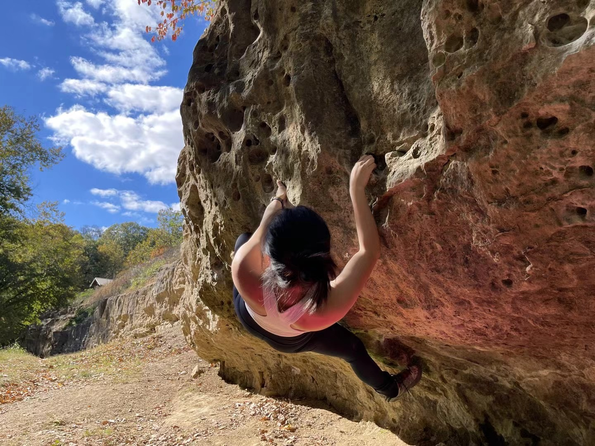
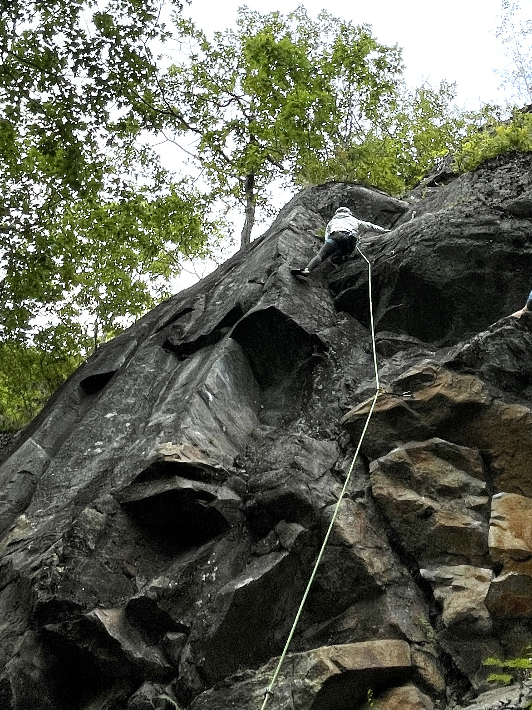

::: {.research-hero}

### Challenge, focus, and community

Outside of research, I spend much of my time rock climbing, both indoors and outdoors. I’m drawn to the balance of focus and adaptability it requires, and to the way each climb becomes a problem to solve in real time.

Climbing has also given me a strong sense of community. I’m grateful for the friends who challenge and support me along the way. Their encouragement and trust have shaped not only how I climb, but how I approach difficult problems more broadly.

:::

---

::: {.photo-grid}

*Muscatatuck Park, Indiana (2022)*

*Acadia National Park, Maine (2023)*

*Rumney, New Hampshire (2023)*

:::