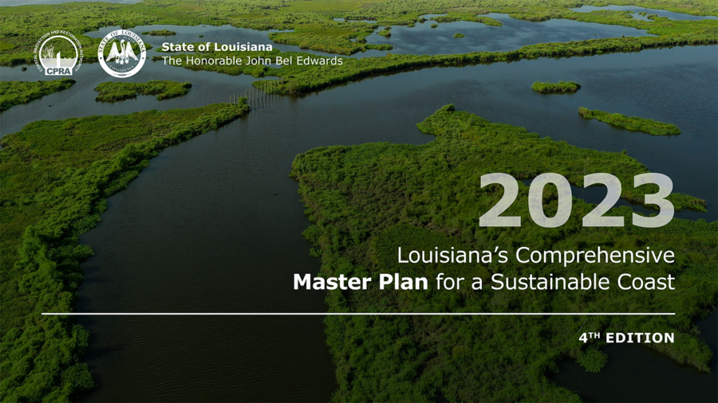
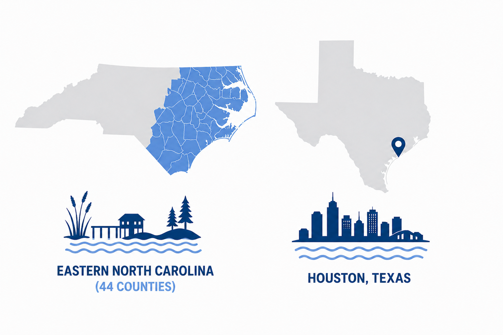
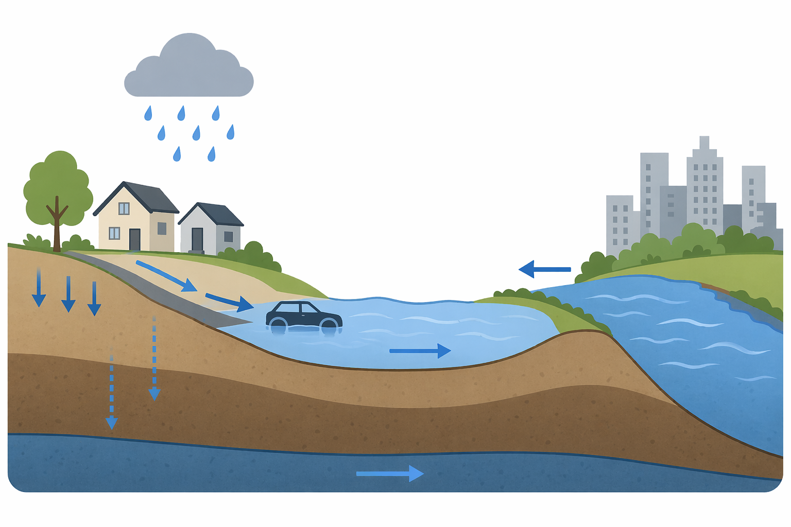

## Real-World Impact & Engagement

::: {.impact-hero-map}
::: {.impact-hero-content}
### From research models to real-world decisions

My work connects computational risk modeling with **state-scale planning**, **practitioner collaboration**, and **industry-scale flood model development**.

::: {.impact-hero-tags}
Louisiana
North Carolina
Texas
Industry flood modeling
:::
:::
:::

::: {.impact-grid}

::: {.impact-card .impact-card-featured}

### Louisiana Coastal Master Plan

::: {.impact-two-col}
::: {.impact-text}

This work contributed to large-scale risk modeling for the **2023 Louisiana Coastal Master Plan**, supporting long-term coastal risk analysis, protection and restoration evaluation, and levee and nonstructural planning.

::: {.impact-highlight}
Contributed to technical analyses supporting **$50-billion 50-year statewide coastal planning**.
:::

:::

::: {.impact-figure}

:::
:::

**Peer-reviewed technical reports**

::: {.report-list}

1. Fischbach, J. R., Johnson, D. R., Wang, J., Hemmerling, S., Cobell, Z., & Diaz, O. (2023). *2023 Coastal Master Plan: Attachment C3: 50-Year FWOA Model Output, Regional Summaries.* Version 3. Baton Rouge, Louisiana: Coastal Protection and Restoration Authority.

2. Johnson, D. R., Fischbach, J. R., Kane, P., Wang, J., & Wilson, M. (2023). *2023 Coastal Master Plan: Attachment C6: Future With Master Plan Model Outputs, Regional Summaries – Risk.* Version 2. Baton Rouge, Louisiana: Coastal Protection and Restoration Authority.

3. Johnson, D. R., Fischbach, J. R., Geldner, N. B., Wilson, M. T., Story, C., & Wang, J. (2023). *2023 Coastal Master Plan: Attachment C11: 2023 Risk Model.* Version 3. Baton Rouge, Louisiana: Coastal Protection and Restoration Authority.

4. Wilson, M. T., Fischbach, J. R., Johnson, D. R., Wang, J., Kane, P., Geldner, N., & Littman, A. (2023). *2023 Coastal Master Plan: Attachment E3: Nonstructural Protection Evaluation Results.* Version 3. Baton Rouge, Louisiana: Coastal Protection and Restoration Authority.

5. Hemmerling, S. A., Kane, P., Littman, A., Cobell, Z., Diaz, O., Fischbach, J. R., Johnson, D. R., & Wang, J. (2023). *2023 Coastal Master Plan: Supplemental Material H6.1: Historic Storm Run - Ike.* Version 1. Baton Rouge, Louisiana: Coastal Protection and Restoration Authority.

6. Hemmerling, S. A., Kane, P., Littman, A., Cobell, Z., Diaz, O., Fischbach, J. R., Johnson, D. R., & Wang, J. (2023). *2023 Coastal Master Plan: Supplemental Material H6.2: Historic Storm Run - Rita.* Version 2. Baton Rouge, Louisiana: Coastal Protection and Restoration Authority.

7. Hemmerling, S. A., Kane, P., Littman, A., Cobell, Z., Diaz, O., Fischbach, J. R., Johnson, D. R., & Wang, J. (2023). *2023 Coastal Master Plan: Supplemental Material H6.3: Historic Storm Run - Barry.* Version 2. Baton Rouge, Louisiana: Coastal Protection and Restoration Authority.

8. Hemmerling, S. A., Kane, P., Littman, A., Cobell, Z., Diaz, O., Fischbach, J. R., Johnson, D. R., & Wang, J. (2023). *2023 Coastal Master Plan: Supplemental Material H6.4: Historic Storm Run - Ida.* Version 2. Baton Rouge, Louisiana: Coastal Protection and Restoration Authority.

9. Hemmerling, S. A., Kane, P., Littman, A., Cobell, Z., Diaz, O., Fischbach, J. R., Johnson, D. R., & Wang, J. (2023). *2023 Coastal Master Plan: Supplemental Material H6.5: Historic Storm Run - Isaac.* Version 2. Baton Rouge, Louisiana: Coastal Protection and Restoration Authority.

10. Hemmerling, S. A., Georgiou, I. Y., Cobell, Z., Diaz, O., Fischbach, J. R., Johnson, D. R., & Wang, J. (2023). *2023 Coastal Master Plan: Supplemental Material H6.7: Restoration Impacts on Surge and Risk – Coastal Forests.* Version 2. Baton Rouge, Louisiana: Coastal Protection and Restoration Authority.

11. Johnson, D. R., Fischbach, J. R., Kane, P., Wang, J., Cobell, Z., & Diaz, O. (2024). *2023 Coastal Master Plan: Supplemental Material H6.8: Interaction of Protection and Restoration Projects.* Version 1. Baton Rouge, Louisiana: Coastal Protection and Restoration Authority.

:::

:::

::: {.impact-card}

### Practitioner Engagement in North Carolina and Texas

::: {.impact-figure .impact-figure-wide}

:::

The modeling frameworks and policy insights are being extended through practitioner-facing collaborations connected to the CHEER research network, with applications in **eastern North Carolina** and **Houston, Texas**.

::: {.impact-highlight}
Focus: translating research models into practical tools for evaluating mitigation strategies, funding design, and risk-informed planning.
:::

:::

::: {.impact-card}

### Industry Flood Model Development

::: {.impact-figure .impact-figure-wide}

:::

As a **Senior Flood Engineer at Karen Clark and Company**, I contributed to large-scale flood model development for coastal and inland flooding across the United States.

::: {.impact-highlight}
Developed automated modeling workflows supporting **large-scale U.S. flood event prediction** and reproducible model development.
:::

This work included research on hydrology and flood physics, review of historical flood events, refinement of stochastic flood catalogs, and integration of automated modeling frameworks.

:::

:::

::: {.impact-summary}
Together, these efforts connect **model development**, **decision support**, and **real-world implementation** for disaster risk management and infrastructure resilience.
:::