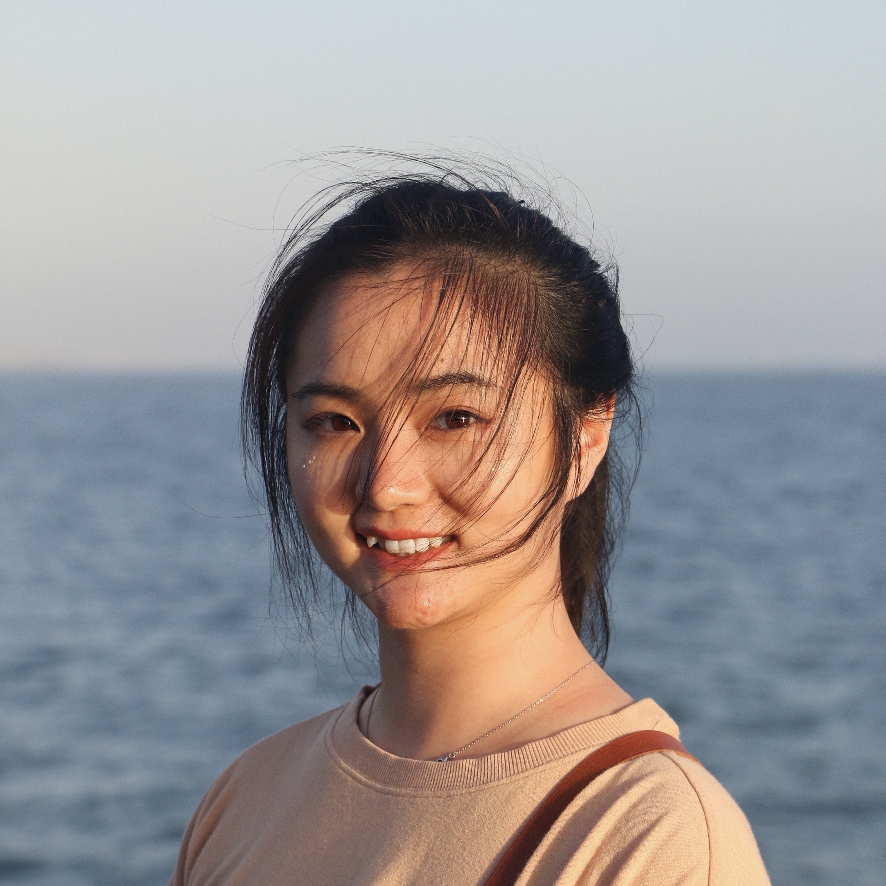

::: {.layout}

::: {.sidebar}

{.profile-photo}

## Jingya Wang, Ph.D.
Postdoctoral Researcher  
Disaster Research Center  

*Natural hazards · infrastructure systems · decision-making under uncertainty*

[Google Scholar](https://scholar.google.com/citations?user=xpaSPBMAAAAJ&hl=en)  
[LinkedIn](https://www.linkedin.com/in/jingya-wang-purdue/)  
wangjy@udel.edu

::: {.sidebar-section}
### Research Interests

- Infrastructure Risk & Resilience
- Adaptive Decision-Making under Uncertainty
- Interdependent Systems Modeling
- AI & Optimization in Disaster Science
- Climate Adaptation Policy
:::

:::

::: {.main}

## About Me

I study how disaster risk emerges from interactions among **natural hazards**, **infrastructure systems**, and **human decision-making**, developing computational frameworks under **deep uncertainty** that link **hazard physics** with the **natural, built, and social systems** shaping risk.

Currently, I am a Postdoctoral Researcher at the NSF-funded [Coastal Hazards, Economic Prosperity, and Resilience (CHEER) Hub](https://www.drc.udel.edu/cheer/) within the [Disaster Research Center](https://www.drc.udel.edu/). Working with [Dr. Rachel Davidson](https://ccee.udel.edu/faculty/rachel-davidson/) and [Dr. Linda Nozick](https://www.duffield.cornell.edu/people/linda-k-nozick/), I focus on **integrating hazard processes, built environment, human behavior, and policy decisions** into unified modeling frameworks to understand how interventions shape long-term risk and resilience.

I earned my Ph.D. in Industrial Engineering from Purdue University, advised by [Dr. David Johnson](https://engineering.purdue.edu/IE/people/ptProfile?resource_id=126281). My doctoral work developed **adaptive infrastructure strategies using reinforcement learning and belief updating** for decision-making under deep uncertainty, and contributed to the risk assessment models used in *Louisiana’s $50 billion Comprehensive Master Plan for a Sustainable Coast*.

My work has been recognized through research awards, competitive funding, and professional leadership. I have served as Chair of the [Engineering and Infrastructure Specialty Group](https://www.sra.org/risk-analysis-specialty-groups/engineering-and-infrastructure/) of the [Society for Risk Analysis](https://www.sra.org/), and was named an [NSF Ocean Decade Champion](https://www.nsf.gov/news/supporting-women-ocean-sciences). I have also received recognition for my research on adaptive decision-making under uncertainty.

## News

- **Jul 2026** — Our work on multi-stakeholder risk and land-use planning will be presented at the 13th U.S. National Conference on Earthquake Engineering (13NCEE), Portland, OR, examining how development dynamics reshape long-term disaster risk.

- **May 2026** — Research spotlight presentation at the NHERI Computational Symposium on computational methods for modeling long-term sequences of hazard losses and their implications for recovery and resilience.

- **Mar 2026** — Two first-authored papers accepted:
  - *Stakeholder Dynamics in Disaster Mitigation Funding* (International Journal of Disaster Risk Reduction)
  - *Optimization-Based Event-Loss Scenario Generation* (Journal of Risk and Uncertainty in Engineering Systems)

- **Dec 2025** — Presented first-authored research at the Society for Risk Analysis Annual Meeting on how land-use planning and multi-stakeholder dynamics shape disaster risk and its distribution.

[More updates →](news.qmd)

:::

:::