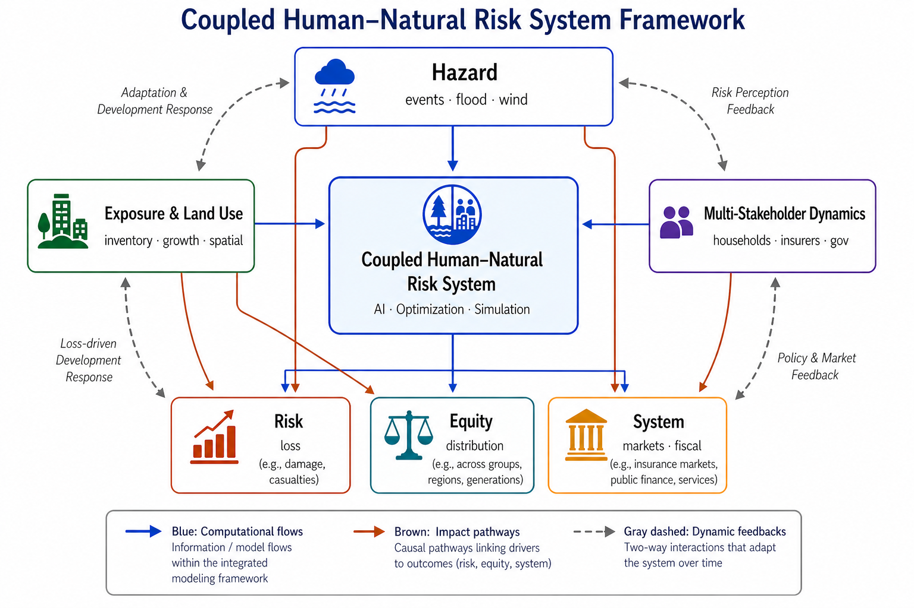
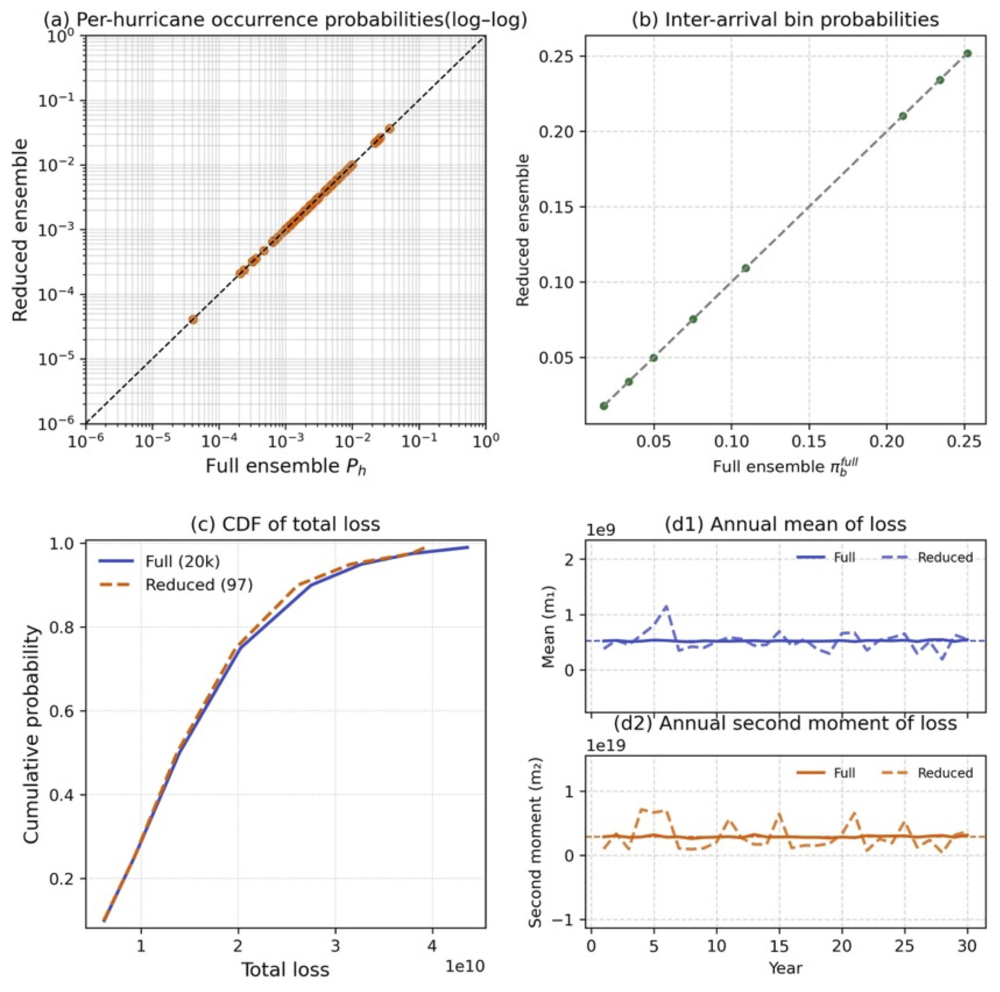
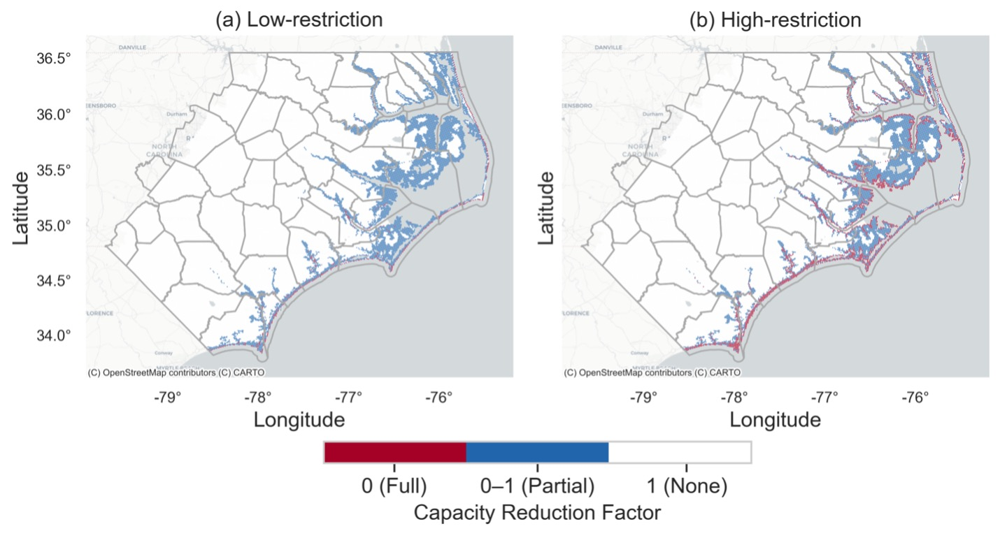
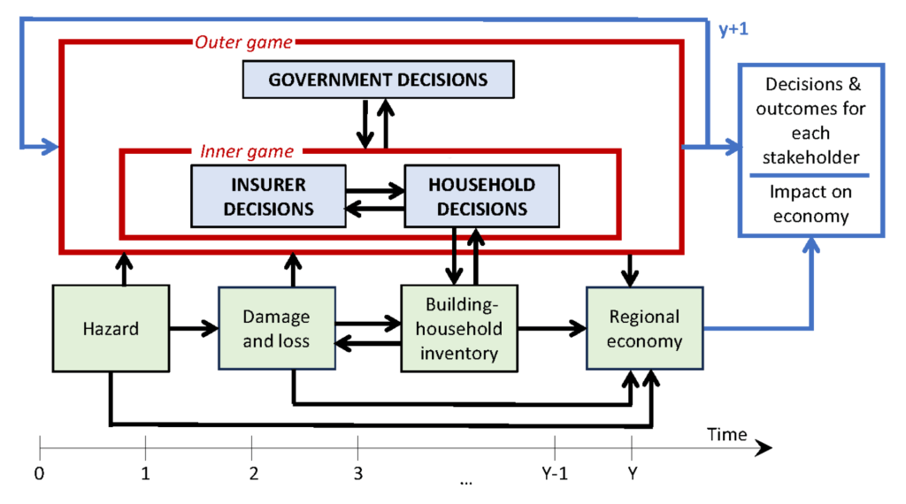
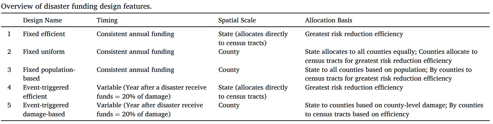
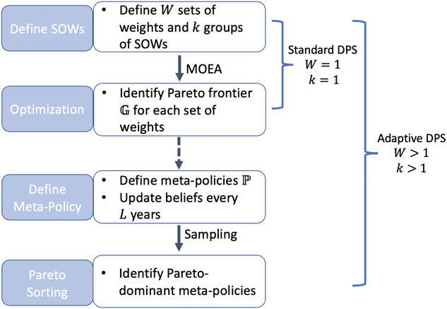

::: {.research-hero}

::: {.hero-figure-full}

:::

::: {.hero-text}

I develop computational decision models for infrastructure resilience, climate adaptation, and multi-hazard risk under deep uncertainty.

My work integrates **hazard and loss modeling**, **dynamic exposure**, **infrastructure and built-environment systems**, and **multi-stakeholder decision-making**, using **optimization, simulation, and AI-enabled methods** to evaluate policies and support adaptive resilience planning.

:::

::: {.hero-tags}

Hazard & Loss Modeling
Dynamic Exposure & Land Use
Multi-Stakeholder Decisions
AI, Optimization & Policy Design

:::

:::

---

## Selected Projects

::: {.research-project}

::: {.research-project-figure}

:::

::: {.research-project-text}

### Hazard & Loss Modeling {#hazard-loss-modeling}

**How can long-term hazard and loss processes be represented efficiently enough to support regional risk analysis and decision modeling?**

This research area develops probabilistic and computationally efficient methods for representing long-term hazard and loss processes. The focus is on preserving the spatial, temporal, and probabilistic features that matter for regional risk analysis while enabling tractable large-scale simulation and decision modeling.

**Selected publication**  
Wang, J., Davidson, R. A., & Nozick, L. K. (2026). *An Optimization-Based Approach to Developing Computationally Efficient Long-Term Event-Loss Scenario Ensembles.* *ASCE-ASME Journal of Risk and Uncertainty in Engineering Systems, Part A: Civil Engineering*, 12(4). [DOI](https://doi.org/10.1061/AJRUA6.RUENG-2004)

:::

:::

::: {.research-project}

::: {.research-project-figure}

:::

::: {.research-project-text}

### Dynamic Exposure & Land Use {#dynamic-exposure-and-land-use}

**How do growth, development patterns, and land-use interventions reshape future disaster risk?**

This research examines how development patterns, building inventory growth, and land-use policies reshape future disaster risk. Exposure is treated as dynamic rather than fixed, with emphasis on how policy can guide where growth occurs, who remains exposed, and how losses are redistributed over time.

**Selected publications**  
Wang, J., Williams, C., Davidson, R., Nozick, L., & Millea, M. (2026). *Coupling Land Use Planning and Multi-Stakeholder Dynamics to Inform Disaster Risk Management: Who Pays for Risk and Who Gains from Intervention?* *International Journal of Disaster Risk Reduction*, 142, 106222. [DOI](https://doi.org/10.1016/j.ijdrr.2026.106222)

Wang, J., Williams, C., Davidson, R., Nozick, L., & Millea, M. (2026). *A Multi-Stakeholder Analysis of the Effects of Building Inventory Dynamics and Land Use Planning on Disaster Risk.* 13th U.S. National Conference on Earthquake Engineering (13NCEE), Portland, OR.

:::

:::

::: {.research-project}

::: {.research-project-figure}

:::

::: {.research-project-text}

### Multi-Stakeholder Risk & Policy Dynamics {#multi-stakeholder-risk-and-policy-design}

**How do households, insurers, and governments interact to shape risk and policy outcomes?**

This research develops computational models of how households, insurers, and governments respond to changing risk. It examines how mitigation funding, insurance pricing, household adaptation, and public programs interact to shape affordability, market outcomes, equity, and long-term risk reduction.

**Selected publications**  
Wang, J., Siders, A. R., Davidson, R., & Nozick, L. K. (2026). *Stakeholder Dynamics in Disaster Mitigation Funding: The Roles of Timing, Spatial Scale and Allocation Basis in Policy Design.* *International Journal of Disaster Risk Reduction*, 138, 106120. [DOI](https://doi.org/10.1016/j.ijdrr.2026.106120)

Davidson, R. A., Nozick, L. K., Kruse, J., Trainor, J., Millea, M., Sue Wing, I., Liu, D., Williams, C., & Wang, J. (2025). *Stakeholder-based tool for the analysis of regional risk.* *Natural Hazards Review*, 26(3), 04025031. [DOI](https://doi.org/10.1061/NHREFO.NHENG-2321)

:::

:::

::: {.research-project}

::: {.research-project-figure}

:::

::: {.research-project-text}

### AI, Optimization & Decision Support {#ai-optimization-policy-design}

**How can optimization, simulation, and AI-enabled methods support policy design under uncertainty?**

This research uses optimization, simulation, learning-based methods, and decision analysis to support decision-making under deep uncertainty. The goal is to connect complex system dynamics with interpretable tools for evaluating trade-offs across risk reduction, equity, affordability, and infrastructure performance.

**Selected publications**

Wang, J., & Johnson, D. R. (2024). *Incorporating learning into direct policy search for flood risk management.* *Risk Analysis*, 44(1), 190–202. [DOI](https://doi.org/10.1111/risa.14136)

Recognition: Student Merit Award (Best Student Research), Engineering and Infrastructure Specialty Group, Society for Risk Analysis (2022)

Johnson, D. R., Wang, J., Geldner, N. B., & Zehr, A. B. (2022). *Rapid, risk-based levee design framework for greater risk reduction at lower cost than standards-based design.* *Journal of Flood Risk Management*, 15(2), e12786. [DOI](https://doi.org/10.1111/jfr3.12786)

:::

:::

---

## Publications

For a complete list of publications, please see my [Google Scholar](https://scholar.google.com/citations?user=xpaSPBMAAAAJ&hl=en).